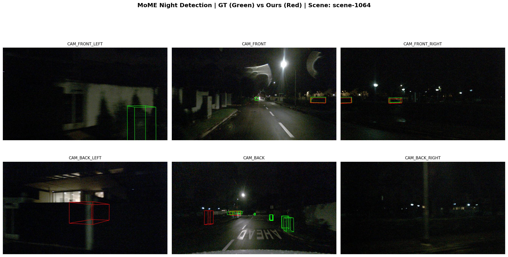
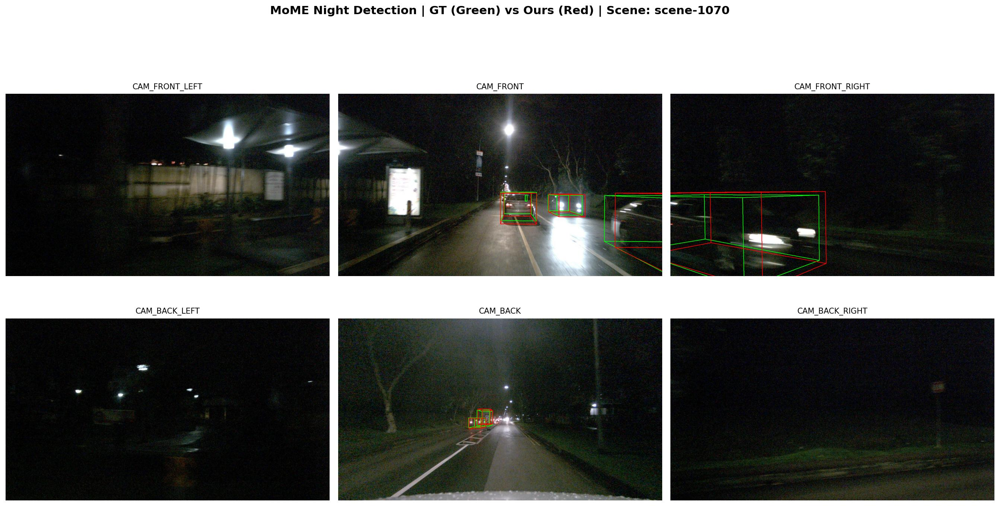
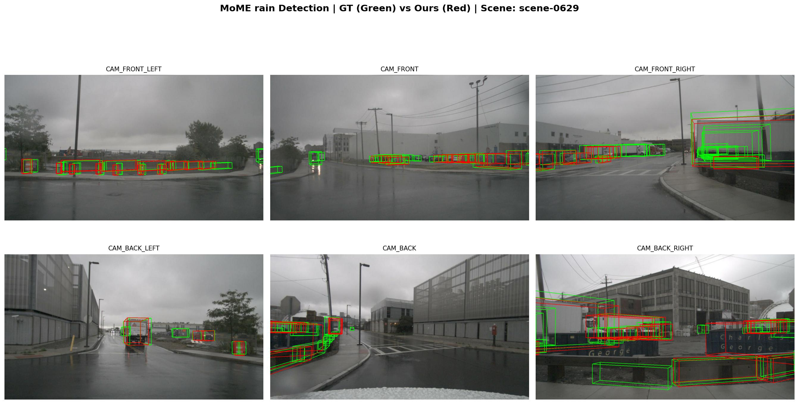
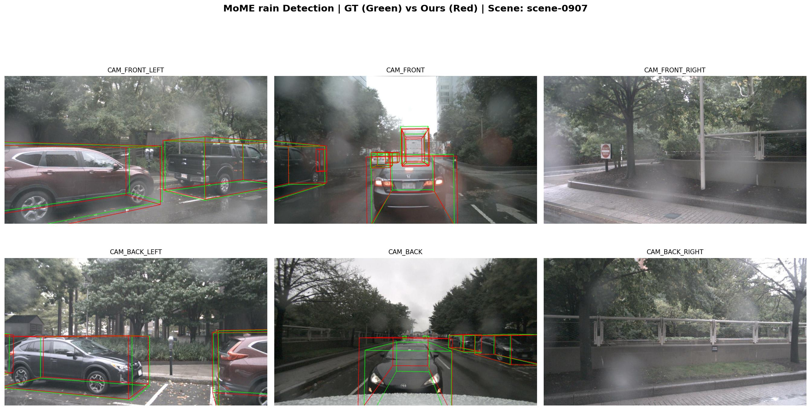
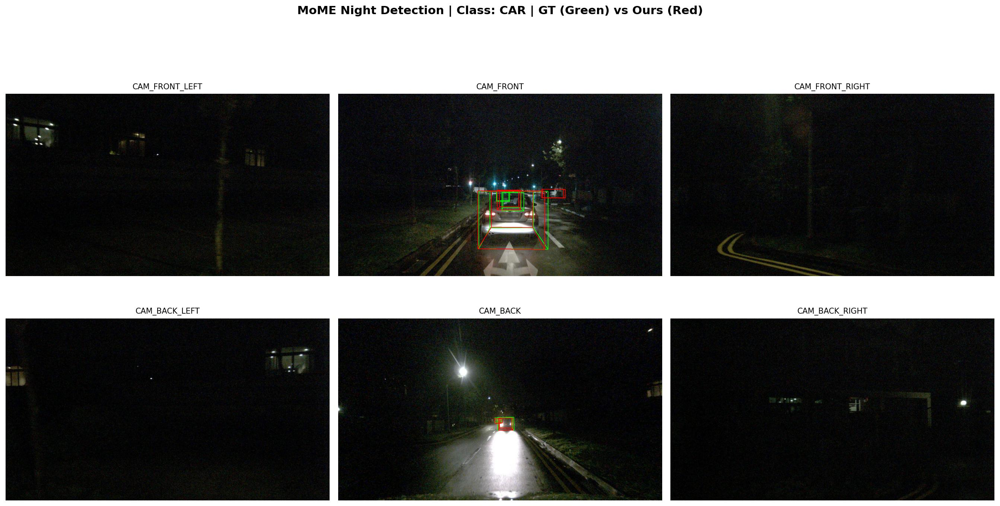
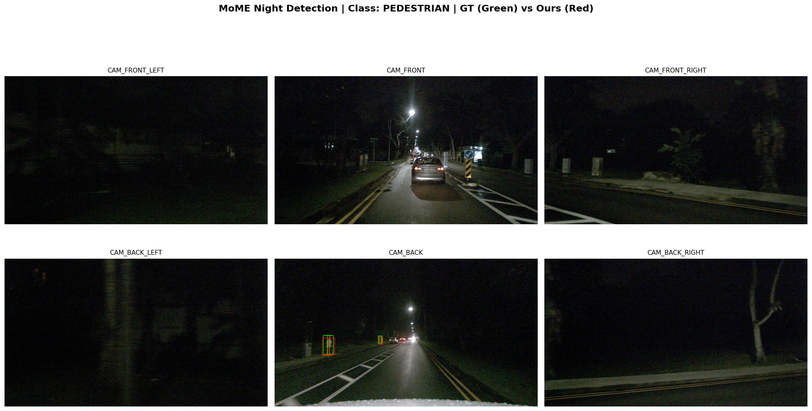
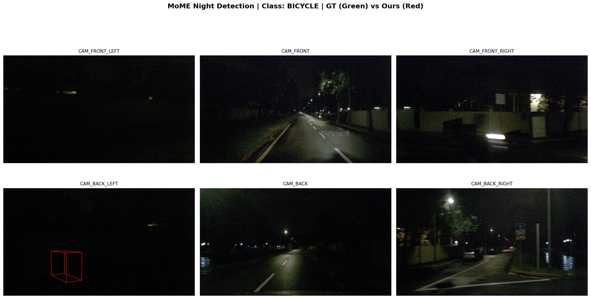
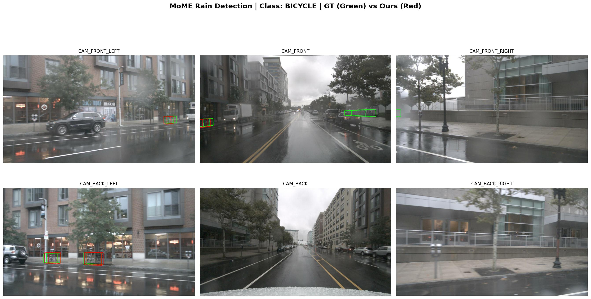
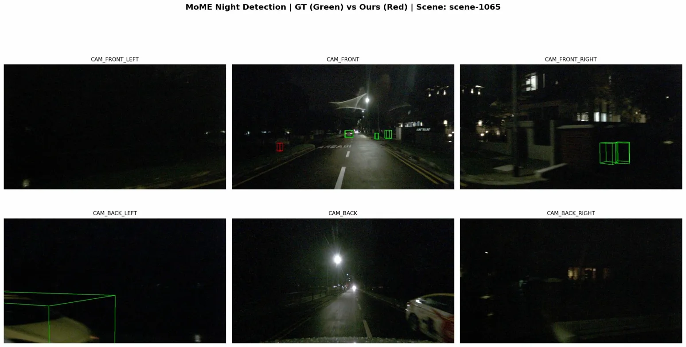

# nuScenes로 MoME 모델 평가

상태: 완료
담당자: 최경진
마감일: 2026/03/25
진행도: 100

- 

### 진행한 순

- [x]  할당받은 DL2 서버 원격 접속 (터미널, vscode 모두)
- [x]  환경 설정
- [x]  nuScenes 데이터셋 다운로드
- [x]  nuScenes 데이터셋 전처리
- [x]  MoME weight 다운로드
- [x]  데이터셋에서 night/rain 씬 필터링
- [x]  MoME 평가
- [x]  지표 시각화 및 정리

---

### 결과

- 표
    - 데이터 조건별 성능 지표
        
        
        | Metric | Full Validation set | Night | Rain |
        | --- | --- | --- | --- |
        | mAP | 71.2 | 42.78 | 71.98 |
        | mATE | 0.2874 | 0.4885 | 0.2801 |
        | mASE | 0.2536 | 0.4527 | 0.2675 |
        | mAOE | 0.3500 | 0.4086 | 0.2577 |
        | mAVE | 0.2560 | 0.5496 | 0.1941 |
        | mAAE | 0.1916 | 0.5859 | 0.1430 |
        | NDS | 73.6 | 46.53 | 74.56 |
        - night, rain 조건에 맞춰 필터링한 nuScenes validation  사용
        - Night 조건에서 mAP가 급격히 낮은 이유는 아래 클래스별 지표와 함께 설명
        - Full validation set 수치는 실험을 직접 진행하지 않고 MoME 논문 Table 1 수치를 인용. 따라서 Rain mAP(71.98)가 Full val mAP(71.2)보다 높게 나온 것은 실험 환경 차이에 의한 것으로 추정
        
    - night 조건에서 class별 성능
        
        
        | Class | AP (↑) | ATE (↓) | ASE (↓) | AOE (↓) | AVE (↓) | AAE (↓) |
        | --- | --- | --- | --- | --- | --- | --- |
        | Car | 0.898 | 0.169 | 0.119 | 0.034 | 0.399 | 0.459 |
        | Truck | 0.836 | 0.186 | 0.109 | 0.019 | 0.370 | 0.656 |
        | Motorcycle | 0.833 | 0.168 | 0.248 | 0.159 | 0.409 | 0.468 |
        | Pedestrian | 0.709 | 0.094 | 0.263 | 0.289 | 0.115 | 0.102 |
        | Barrier | 0.604 | 0.250 | 0.188 | 0.046 | - | - |
        | Bicycle | 0.397 | 0.169 | 0.281 | 0.131 | 0.104 | 0.002 |
        | Traffic Cone | 0.001 | 0.849 | 0.319 | - | - | - |
        | Bus | 0.000 | 1.000 | 1.000 | 1.000 | 1.000 | 1.000 |
        | Trailer | 0.000 | 1.000 | 1.000 | 1.000 | 1.000 | 1.000 |
        | Construction
         Vehicle | 0.000 | 1.000 | 1.000 | 1.000 | 1.000 | 1.000 |
        - Bus, Trailer, Construction Vehicle의 AP가 0.000으로 기록됨. night 특성상 해당 클래스가 등장하는 scene이 validation subset 내에 존재하지 않아 평가 자체가 이루어지지 않은 것으로 추정
        - mAP는 10개 클래스 AP의 단순 평균이기에, AP가 0인 4개 클래스(Bus, Trailer, Construction Vehicle, Traffic Cone)가 전체 mAP를 크게 떨어트린 것으로 추정. 해당 4개 클래스를 제외한 나머지 6개 클래스의 평균 AP는 0.712로, Rain 조건과 유사함.
        - 4개의 클래스를 제외한 AP는 0.712
        
    - rain 조건에서 class별 성능
        
        
        | Class | AP (↑) | ATE (↓) | ASE (↓) | AOE (↓) | AVE (↓) | AAE (↓) |
        | --- | --- | --- | --- | --- | --- | --- |
        | Car | 0.905 | 0.167 | 0.144 | 0.044 | 0.221 | 0.139 |
        | Truck | 0.847 | 0.154 | 0.315 | 0.262 | 0.217 | 0.062 |
        | Motorcycle | 0.829 | 0.148 | 0.267 | 0.574 | 0.280 | 0.004 |
        | Pedestrian | 0.825 | 0.333 | 0.187 | 0.029 | 0.285 | 0.628 |
        | Barrier | 0.823 | 0.215 | 0.300 | 0.028 | - | - |
        | Bicycle | 0.770 | 0.144 | 0.316 | - | - | - |
        | Traffic Cone | 0.671 | 0.381 | 0.189 | 0.043 | 0.154 | 0.098 |
        | Bus | 0.634 | 0.151 | 0.337 | 0.173 | 0.133 | 0.006 |
        | Trailer | 0.550 | 0.539 | 0.221 | 0.586 | 0.177 | 0.084 |
        | Construction
         Vehicle | 0.344 | 0.569 | 0.398 | 0.581 | 0.086 | 0.124 |
        - Night 조건과 달리 10개 클래스 모두 AP가 측정됨.
        - Motorcycle의 AOE(0.574)가 유독 높음. 오토바이는 객체 크기가 비교적 작고, 전후 방향 구분이 어려워 높은 것으로 추정
        
        ⇒ 전반적으로 rain 조건에서는 Full validation 대비 성능 저하가 크지 않아, MoME가  rain에 대한 robustness를 어느 정도 갖추고 있음을 확인. 반면 night 조건에서의 성능 저하가 뚜렷하여, night에 대한 성능 개선이 필요함을 확인.
        
    
- 시각화 (ground truth와 prediction 비교)
    - 데이터 조건별
        - night
            
            
            
            
            
        - rain
            
            
            
            
            
    - 클래스별
        - night
            
            
            
            car class
            
            
            
            pedestrian class
            
            
            
            bicycle class
            
        - rain
            
            
            
            pedestrian class
            
            
            
            car class
            
            
            
            bicycle class
            
        
- 수치
    - night evaluation result
        
        Evaluating bboxes of pts_bbox
        mAP: 0.4278
        
        mATE: 0.4885
        mASE: 0.4527
        mAOE: 0.4086
        mAVE: 0.5496
        mAAE: 0.5859
        NDS: 0.4653
        Eval time: 2.7s
        
        Per-class results:
        Object Class            AP      ATE     ASE     AOE     AVE     AAE
        
        car                     0.898   0.169   0.119   0.034   0.399   0.459
        truck                   0.836   0.186   0.109   0.019   0.370   0.656
        bus                     0.000   1.000   1.000   1.000   1.000   1.000
        trailer                 0.000   1.000   1.000   1.000   1.000   1.000
        construction_vehicle    0.000   1.000   1.000   1.000   1.000   1.000
        pedestrian              0.709   0.094   0.263   0.289   0.115   0.102
        motorcycle              0.833   0.168   0.248   0.159   0.409   0.468
        bicycle                 0.397   0.169   0.281   0.131   0.104   0.002
        traffic_cone            0.001   0.849   0.319   nan     nan     nan
        
        barrier                 0.604   0.250   0.188   0.046   nan     nan
        
        {'pts_bbox_NuScenes/car_AP_dist_0.5': 0.8231, 'pts_bbox_NuScenes/car_AP_dist_1.0': 0.9029, 'pts_bbox_NuScenes/car_AP_dist_2.0': 0.9292, 'pts_bbox_NuScenes/car_AP_dist_4.0': 0.9355, 'pts_bbox_NuScenes/car_trans_err': 0.1687, 'pts_bbox_NuScenes/car_scale_err': 0.1192, 'pts_bbox_NuScenes/car_orient_err': 0.0341, 'pts_bbox_NuScenes/car_vel_err': 0.3992, 'pts_bbox_NuScenes/car_attr_err': 0.4588, 'pts_bbox_NuScenes/mATE': 0.4885, 'pts_bbox_NuScenes/mASE': 0.4527, 'pts_bbox_NuScenes/mAOE': 0.4086, 'pts_bbox_NuScenes/mAVE': 0.5496, 'pts_bbox_NuScenes/mAAE': 0.5859, 'pts_bbox_NuScenes/truck_AP_dist_0.5': 0.7332, 'pts_bbox_NuScenes/truck_AP_dist_1.0': 0.8607, 'pts_bbox_NuScenes/truck_AP_dist_2.0': 0.875, 'pts_bbox_NuScenes/truck_AP_dist_4.0': 0.8768, 'pts_bbox_NuScenes/truck_trans_err': 0.1863, 'pts_bbox_NuScenes/truck_scale_err': 0.1088, 'pts_bbox_NuScenes/truck_orient_err': 0.019, 'pts_bbox_NuScenes/truck_vel_err': 0.3698, 'pts_bbox_NuScenes/truck_attr_err': 0.6558, 'pts_bbox_NuScenes/construction_vehicle_AP_dist_0.5': 0.0, 'pts_bbox_NuScenes/construction_vehicle_AP_dist_1.0': 0.0, 'pts_bbox_NuScenes/construction_vehicle_AP_dist_2.0': 0.0, 'pts_bbox_NuScenes/construction_vehicle_AP_dist_4.0': 0.0, 'pts_bbox_NuScenes/construction_vehicle_trans_err': 1.0, 'pts_bbox_NuScenes/construction_vehicle_scale_err': 1.0, 'pts_bbox_NuScenes/construction_vehicle_orient_err': 1.0, 'pts_bbox_NuScenes/construction_vehicle_vel_err': 1.0, 'pts_bbox_NuScenes/construction_vehicle_attr_err': 1.0, 'pts_bbox_NuScenes/bus_AP_dist_0.5': 0.0, 'pts_bbox_NuScenes/bus_AP_dist_1.0': 0.0, 'pts_bbox_NuScenes/bus_AP_dist_2.0': 0.0, 'pts_bbox_NuScenes/bus_AP_dist_4.0': 0.0, 'pts_bbox_NuScenes/bus_trans_err': 1.0, 'pts_bbox_NuScenes/bus_scale_err': 1.0, 'pts_bbox_NuScenes/bus_orient_err': 1.0, 'pts_bbox_NuScenes/bus_vel_err': 1.0, 'pts_bbox_NuScenes/bus_attr_err': 1.0, 'pts_bbox_NuScenes/trailer_AP_dist_0.5': 0.0, 'pts_bbox_NuScenes/trailer_AP_dist_1.0': 0.0, 'pts_bbox_NuScenes/trailer_AP_dist_2.0': 0.0, 'pts_bbox_NuScenes/trailer_AP_dist_4.0': 0.0, 'pts_bbox_NuScenes/trailer_trans_err': 1.0, 'pts_bbox_NuScenes/trailer_scale_err': 1.0, 'pts_bbox_NuScenes/trailer_orient_err': 1.0, 'pts_bbox_NuScenes/trailer_vel_err': 1.0, 'pts_bbox_NuScenes/trailer_attr_err': 1.0, 'pts_bbox_NuScenes/barrier_AP_dist_0.5': 0.5361, 'pts_bbox_NuScenes/barrier_AP_dist_1.0': 0.6035, 'pts_bbox_NuScenes/barrier_AP_dist_2.0': 0.6356, 'pts_bbox_NuScenes/barrier_AP_dist_4.0': 0.6402, 'pts_bbox_NuScenes/barrier_trans_err': 0.2503, 'pts_bbox_NuScenes/barrier_scale_err': 0.1878, 'pts_bbox_NuScenes/barrier_orient_err': 0.046, 'pts_bbox_NuScenes/barrier_vel_err': nan, 'pts_bbox_NuScenes/barrier_attr_err': nan, 'pts_bbox_NuScenes/motorcycle_AP_dist_0.5': 0.7216, 'pts_bbox_NuScenes/motorcycle_AP_dist_1.0': 0.8655, 'pts_bbox_NuScenes/motorcycle_AP_dist_2.0': 0.8708, 'pts_bbox_NuScenes/motorcycle_AP_dist_4.0': 0.8738, 'pts_bbox_NuScenes/motorcycle_trans_err': 0.1676, 'pts_bbox_NuScenes/motorcycle_scale_err': 0.2481, 'pts_bbox_NuScenes/motorcycle_orient_err': 0.1587, 'pts_bbox_NuScenes/motorcycle_vel_err': 0.4088, 'pts_bbox_NuScenes/motorcycle_attr_err': 0.4684, 'pts_bbox_NuScenes/bicycle_AP_dist_0.5': 0.3971, 'pts_bbox_NuScenes/bicycle_AP_dist_1.0': 0.3971, 'pts_bbox_NuScenes/bicycle_AP_dist_2.0': 0.3975, 'pts_bbox_NuScenes/bicycle_AP_dist_4.0': 0.3975, 'pts_bbox_NuScenes/bicycle_trans_err': 0.1686, 'pts_bbox_NuScenes/bicycle_scale_err': 0.2812, 'pts_bbox_NuScenes/bicycle_orient_err': 0.1306, 'pts_bbox_NuScenes/bicycle_vel_err': 0.1043, 'pts_bbox_NuScenes/bicycle_attr_err': 0.0024, 'pts_bbox_NuScenes/pedestrian_AP_dist_0.5': 0.7088, 'pts_bbox_NuScenes/pedestrian_AP_dist_1.0': 0.7088, 'pts_bbox_NuScenes/pedestrian_AP_dist_2.0': 0.7088, 'pts_bbox_NuScenes/pedestrian_AP_dist_4.0': 0.7088, 'pts_bbox_NuScenes/pedestrian_trans_err': 0.0945, 'pts_bbox_NuScenes/pedestrian_scale_err': 0.2625, 'pts_bbox_NuScenes/pedestrian_orient_err': 0.2892, 'pts_bbox_NuScenes/pedestrian_vel_err': 0.1149, 'pts_bbox_NuScenes/pedestrian_attr_err': 0.1018, 'pts_bbox_NuScenes/traffic_cone_AP_dist_0.5': 0.0, 'pts_bbox_NuScenes/traffic_cone_AP_dist_1.0': 0.0, 'pts_bbox_NuScenes/traffic_cone_AP_dist_2.0': 0.001, 'pts_bbox_NuScenes/traffic_cone_AP_dist_4.0': 0.0014, 'pts_bbox_NuScenes/traffic_cone_trans_err': 0.8492, 'pts_bbox_NuScenes/traffic_cone_scale_err': 0.3195, 'pts_bbox_NuScenes/traffic_cone_orient_err': nan, 'pts_bbox_NuScenes/traffic_cone_vel_err': nan, 'pts_bbox_NuScenes/traffic_cone_attr_err': nan, 'pts_bbox_NuScenes/NDS': 0.46534341408057145, 'pts_bbox_NuScenes/mAP': 0.42776171944868324}
        
    - rain evaluation result
        
        Evaluating bboxes of pts_bbox
        mAP: 0.7198
        
        mATE: 0.2801
        mASE: 0.2675
        mAOE: 0.2577
        mAVE: 0.1941
        mAAE: 0.1430
        NDS: 0.7456
        Eval time: 12.2s
        
        Per-class results:
        Object Class            AP      ATE     ASE     AOE     AVE     AAE
        
        car                     0.905   0.167   0.144   0.044   0.221   0.139
        truck                   0.671   0.381   0.189   0.043   0.154   0.098
        bus                     0.825   0.333   0.187   0.029   0.285   0.628
        trailer                 0.550   0.539   0.221   0.586   0.177   0.084
        construction_vehicle    0.344   0.569   0.398   0.581   0.086   0.124
        pedestrian              0.847   0.154   0.315   0.262   0.217   0.062
        motorcycle              0.829   0.148   0.267   0.574   0.280   0.004
        bicycle                 0.634   0.151   0.337   0.173   0.133   0.006
        traffic_cone            0.770   0.144   0.316   nan     nan     nan
        
        barrier                 0.823   0.215   0.300   0.028   nan     nan
        
        {'pts_bbox_NuScenes/car_AP_dist_0.5': 0.8284, 'pts_bbox_NuScenes/car_AP_dist_1.0': 0.9158, 'pts_bbox_NuScenes/car_AP_dist_2.0': 0.9335, 'pts_bbox_NuScenes/car_AP_dist_4.0': 0.941, 'pts_bbox_NuScenes/car_trans_err': 0.1671, 'pts_bbox_NuScenes/car_scale_err': 0.1441, 'pts_bbox_NuScenes/car_orient_err': 0.0436, 'pts_bbox_NuScenes/car_vel_err': 0.2206, 'pts_bbox_NuScenes/car_attr_err': 0.1388, 'pts_bbox_NuScenes/mATE': 0.2801, 'pts_bbox_NuScenes/mASE': 0.2675, 'pts_bbox_NuScenes/mAOE': 0.2577, 'pts_bbox_NuScenes/mAVE': 0.1941, 'pts_bbox_NuScenes/mAAE': 0.143, 'pts_bbox_NuScenes/truck_AP_dist_0.5': 0.3612, 'pts_bbox_NuScenes/truck_AP_dist_1.0': 0.6842, 'pts_bbox_NuScenes/truck_AP_dist_2.0': 0.7854, 'pts_bbox_NuScenes/truck_AP_dist_4.0': 0.8519, 'pts_bbox_NuScenes/truck_trans_err': 0.3809, 'pts_bbox_NuScenes/truck_scale_err': 0.1894, 'pts_bbox_NuScenes/truck_orient_err': 0.0434, 'pts_bbox_NuScenes/truck_vel_err': 0.1535, 'pts_bbox_NuScenes/truck_attr_err': 0.0984, 'pts_bbox_NuScenes/construction_vehicle_AP_dist_0.5': 0.1008, 'pts_bbox_NuScenes/construction_vehicle_AP_dist_1.0': 0.3512, 'pts_bbox_NuScenes/construction_vehicle_AP_dist_2.0': 0.444, 'pts_bbox_NuScenes/construction_vehicle_AP_dist_4.0': 0.4808, 'pts_bbox_NuScenes/construction_vehicle_trans_err': 0.5693, 'pts_bbox_NuScenes/construction_vehicle_scale_err': 0.3976, 'pts_bbox_NuScenes/construction_vehicle_orient_err': 0.5814, 'pts_bbox_NuScenes/construction_vehicle_vel_err': 0.0864, 'pts_bbox_NuScenes/construction_vehicle_attr_err': 0.1237, 'pts_bbox_NuScenes/bus_AP_dist_0.5': 0.5314, 'pts_bbox_NuScenes/bus_AP_dist_1.0': 0.8876, 'pts_bbox_NuScenes/bus_AP_dist_2.0': 0.9352, 'pts_bbox_NuScenes/bus_AP_dist_4.0': 0.9474, 'pts_bbox_NuScenes/bus_trans_err': 0.3326, 'pts_bbox_NuScenes/bus_scale_err': 0.1865, 'pts_bbox_NuScenes/bus_orient_err': 0.0285, 'pts_bbox_NuScenes/bus_vel_err': 0.285, 'pts_bbox_NuScenes/bus_attr_err': 0.6281, 'pts_bbox_NuScenes/trailer_AP_dist_0.5': 0.1654, 'pts_bbox_NuScenes/trailer_AP_dist_1.0': 0.5012, 'pts_bbox_NuScenes/trailer_AP_dist_2.0': 0.6846, 'pts_bbox_NuScenes/trailer_AP_dist_4.0': 0.848, 'pts_bbox_NuScenes/trailer_trans_err': 0.5395, 'pts_bbox_NuScenes/trailer_scale_err': 0.2214, 'pts_bbox_NuScenes/trailer_orient_err': 0.5859, 'pts_bbox_NuScenes/trailer_vel_err': 0.1772, 'pts_bbox_NuScenes/trailer_attr_err': 0.0836, 'pts_bbox_NuScenes/barrier_AP_dist_0.5': 0.6779, 'pts_bbox_NuScenes/barrier_AP_dist_1.0': 0.8224, 'pts_bbox_NuScenes/barrier_AP_dist_2.0': 0.8871, 'pts_bbox_NuScenes/barrier_AP_dist_4.0': 0.9032, 'pts_bbox_NuScenes/barrier_trans_err': 0.2146, 'pts_bbox_NuScenes/barrier_scale_err': 0.3002, 'pts_bbox_NuScenes/barrier_orient_err': 0.0282, 'pts_bbox_NuScenes/barrier_vel_err': nan, 'pts_bbox_NuScenes/barrier_attr_err': nan, 'pts_bbox_NuScenes/motorcycle_AP_dist_0.5': 0.8113, 'pts_bbox_NuScenes/motorcycle_AP_dist_1.0': 0.8348, 'pts_bbox_NuScenes/motorcycle_AP_dist_2.0': 0.8348, 'pts_bbox_NuScenes/motorcycle_AP_dist_4.0': 0.8348, 'pts_bbox_NuScenes/motorcycle_trans_err': 0.1484, 'pts_bbox_NuScenes/motorcycle_scale_err': 0.2671, 'pts_bbox_NuScenes/motorcycle_orient_err': 0.5735, 'pts_bbox_NuScenes/motorcycle_vel_err': 0.2803, 'pts_bbox_NuScenes/motorcycle_attr_err': 0.0037, 'pts_bbox_NuScenes/bicycle_AP_dist_0.5': 0.6114, 'pts_bbox_NuScenes/bicycle_AP_dist_1.0': 0.6363, 'pts_bbox_NuScenes/bicycle_AP_dist_2.0': 0.639, 'pts_bbox_NuScenes/bicycle_AP_dist_4.0': 0.6484, 'pts_bbox_NuScenes/bicycle_trans_err': 0.1511, 'pts_bbox_NuScenes/bicycle_scale_err': 0.3367, 'pts_bbox_NuScenes/bicycle_orient_err': 0.1727, 'pts_bbox_NuScenes/bicycle_vel_err': 0.1331, 'pts_bbox_NuScenes/bicycle_attr_err': 0.0065, 'pts_bbox_NuScenes/pedestrian_AP_dist_0.5': 0.8345, 'pts_bbox_NuScenes/pedestrian_AP_dist_1.0': 0.8426, 'pts_bbox_NuScenes/pedestrian_AP_dist_2.0': 0.8548, 'pts_bbox_NuScenes/pedestrian_AP_dist_4.0': 0.8579, 'pts_bbox_NuScenes/pedestrian_trans_err': 0.1541, 'pts_bbox_NuScenes/pedestrian_scale_err': 0.3154, 'pts_bbox_NuScenes/pedestrian_orient_err': 0.2624, 'pts_bbox_NuScenes/pedestrian_vel_err': 0.2168, 'pts_bbox_NuScenes/pedestrian_attr_err': 0.0615, 'pts_bbox_NuScenes/traffic_cone_AP_dist_0.5': 0.7325, 'pts_bbox_NuScenes/traffic_cone_AP_dist_1.0': 0.7501, 'pts_bbox_NuScenes/traffic_cone_AP_dist_2.0': 0.7805, 'pts_bbox_NuScenes/traffic_cone_AP_dist_4.0': 0.8178, 'pts_bbox_NuScenes/traffic_cone_trans_err': 0.1435, 'pts_bbox_NuScenes/traffic_cone_scale_err': 0.3164, 'pts_bbox_NuScenes/traffic_cone_orient_err': nan, 'pts_bbox_NuScenes/traffic_cone_vel_err': nan, 'pts_bbox_NuScenes/traffic_cone_attr_err': nan, 'pts_bbox_NuScenes/NDS': 0.7456389711719519, 'pts_bbox_NuScenes/mAP': 0.7197793359929767}
        

---

### 트러블 슈팅

- vscode remote ssh 접속 오류
    
    #### 발생한 문제
    
    remote-ssh 설치 후, DL2 서버 접속 시도 시 다음과 같은 오류 발생
    
    ```jsx
    > Permission denied, please try again.
    ...
    Install terminal quit with output: 프로세스에서 없는 파이프에 쓰려고 했습니다.
    Received install output: 프로세스에서 없는 파이프에 쓰려고 했습니다.
    ...
    ```
    
    #### 해결 방법 및 원인 분석
    
    - 로컬 컴퓨터의 C:\Users\users\.ssh\known_hosts파일에서, 할당 받은 서버 ip 관련 내용을 지우고 저장해, vscode 다시 실행해 접속 시도 ⇒ 여전히 동일한 오류 발생
    - 로컬 컴퓨터의 C:\Users\users\.ssh\config 파일에서, ip주소와 userid 직접 등록 후 , 
    vscode 다시 실행해 접속 시도 ⇒ 성공
    - 맨처음 접속 시도 시, 서버 접속 주소를 잘못 작성. 해당 기록을 바탕으로 이후의 접속이 계속 시도되어 오류가 발생한 것으로 추정
    
- prediction 바운딩 박스 시각화 오류
    
    #### 발생한 문제
    
    초기에는, prediction 바운딩 박스가 거의 출력 되지 않는 문제 발생
    해당 문제 해결 이후에는, 박스가 일부 출력 되었으나 ground truth와 방향 및 위치 불일치
    
    
    
    바운딩 박스 출력 개수 적음
    
    
    
    출력된 박스의 방향 및 위치가 ground truth와 불일치
    
    #### 해결 방법
    
    - **LiDAR → ego 좌표 변환 추가**
        
        ```jsx
        xyz_ego = lidar2ego_rot @ box[:3] + lidar2ego_trans
        ```
        
    - **yaw 쿼터니언 변환 적용**
        
        ```jsx
        pred_quat = Quaternion(axis=[0, 0, 1], angle=box[6])
        rotated_quat = lidar2ego_quat * pred_quat
        final_yaw = rotated_quat.yaw_pitch_roll[0]
        ```
        
    - **z축 중심점 보정**
        
        ```jsx
        box[2] += box[5] / 2
        ```
        
    - **w, l 순서 스왑**
        
        ```jsx
        w = box[4]
        l = box[3]
        ```
        
    - 카메라 뒤에 위치한 박스 처리 조건을 8개 코너 중 4개 이상이 z>0인 경우에만 해당 박스를 스킵하는
    것으로 완화
    - draw_box_on_images 함수 호출 코드를 for 루프 내부로 이동
    
    #### 원인 분석
    
    - 바운딩 박스 개수 부족 문제의 경우, draw_box_on_iamges 함수가 for 루프에 걸리지 않아, 1개의 바운딩 박스만 생성되었던 것으로 확인.
    - 바운딩 박스의 방향 및 위치 불일치 문제의 경우, 다양한 원인이 존재
        - 좌표계 불일치 : prediction 바운딩 박스의 경우 LiDAR 좌표계 기준으로 출력되고, gt 박스는 
                                    ego 좌표계 기준으로 출력됨. 둘의 출력 방식을 통일하지 않고, 동일한 투영 
                                    함수를 사용했기에 위치 불일치 발생
        - yaw(방향각 오류) 변환 오류 : LiDAR → ego 변환 시 yaw를 단순히 더하는 방식 (box[6] = 
                                                     box[6] + lidar2ego_yae) 을 사용. 이후 쿼터니언 곱을 이용해 해결
        - 카메라 뒤 박스 처리 조건 과도한 제한 : 박스의 8개의 코너 중 한 개라도 z<0이면, 박스 전체를 
                                                      스킵해버려 카메라 경계에 걸친 박스들이 모두 제거되는 문제 발생.
        - z축 중심점 기준의 차이 : MMDetection3D의 경우 바운딩 박스와 z좌표를 바닥면의 중심 기준으
                                                   로 저장, nuSceens의 경우 3D 박스의 정중앙을 기준으로 사용. 이를 보
                                                   정 없이 투영해 불일치 발생
        - w, l 순서의 차이 : MMDetection3D의 박스 포맷은 [x, y, z, l, w, h, yaw]의 순서, ground truth의 
                                     박스 포맷은 [x, y, z, w, l, h, yaw]의 순서.

---

### 공부한 내용

- nuScenes 데이터셋 폴더 구조
    - 중요한 폴더는 총 4개,  ‘v1.0-trainval/ ‘,  ‘ samples/’,  ‘sweeps/’,  ‘maps/’
    - v1.0-trainval/
        - 센서 데이터들의 저장 경로, 센서의 각도/위치를 담은 calibration, 어떤 사진의 어느 좌표에 자동차나 보행자가 있다는 정답(bounding box annotation) 등의 정보가 JSON 파일로 기록되어 있음
        - 실제 폴더 구조 및 설명
            
            ```jsx
            v1.0-trainval/
            ├── attribute.json             # 객체의 현재 상태나 세부 속성 (예: 차량이 '주차 중'인지, 보행자가 '걷고 있는지')
            ├── calibrated_sensor.json     # 차량에 달린 각 센서의 정확한 부착 위치, 회전 각도 및 렌즈 파라미터 (캘리브레이션)
            ├── category.json              # 객체의 종류/클래스 분류 (예: car, pedestrian, bicycle 등)
            ├── ego_pose.json              # 특정 순간(타임스탬프)에 자율주행 차량(Ego) 자체가 맵 상에서 어디에 있는지(위치/방향)
            ├── instance.json              # 여러 프레임에 걸쳐 동일한 객체를 추적하기 위해 부여된 객체별 고유 ID (Tracking용)
            ├── log.json                   # 주행 기록 메타데이터 (주행한 날짜, 지역, 차량 정보 등)
            ├── map.json                   # 해당 주행이 이루어진 지역의 지도(HD Map) 데이터 파일과의 연결 정보
            ├── sample.json                # 0.5초(2Hz) 간격으로 정답(Annotation)이 매겨진 핵심 기준 프레임들의 목록
            ├── sample_annotation.json     # 정답지. 각 객체의 3D Bounding Box 크기(w,l,h), 좌표(x,y,z), 회전값
            ├── sample_data.json           # 실제 센서 파일(.jpg, .pcd.bin)이 폴더 어디에 저장되어 있는지(경로)와 찍힌 시간
            ├── scene.json                 # 약 20초 길이로 잘라놓은 전체 주행 씬(Scene) 정보 (첫 sample과 마지막 sample을 연결)
            ├── sensor.json                # 장착된 12개 센서의 종류와 이름 (예: LIDAR_TOP, CAM_FRONT 등)
            └── visibility.json            # 객체가 다른 사물에 안 가려지고 얼마나 잘 보이는지에 대한 가시성 등급 (0~100%)
            ```
            
            - 각각의 JSON 파일은 일종의 관계형 데이터베이스 상의 테이블 역할. 서로 고유한 키(token)로 연결되어 있음
            
    - samples/
        - 주요 센서 데이터. 차는 1초에 수십 번 데이터를 측정. 이를 모두 사용할 수 없기에, 1초에 2번(2Hz) 데이터를 골라냄. 해당 데이터에는 카메라 이미지(.jpg), 라이다(pcd.bin), 레이더 데이터들이 포함됨.
        - 실제 폴더 구조 및 설명
            
            ```jsx
            samples/
            ├── CAM_FRONT/               # 전방 카메라 이미지
            │   ├── n015-2018-07-24-11-22-45+0800__CAM_FRONT__1532402927612460.jpg
            │   └── n015-2018-07-24-11-22-45+0800__CAM_FRONT__1532402928112460.jpg
            ├── CAM_FRONT_LEFT/          # 좌측 전방 카메라
            ├── CAM_BACK/                # 후방 카메라
            ├── ... (총 6개의 카메라 폴더)
            ├── LIDAR_TOP/               # 지붕 위 라이다 센서
            │   ├── n015-2018-07-24-11-22-45+0800__LIDAR_TOP__1532402927647951.pcd.bin
            │   └── n015-2018-07-24-11-22-45+0800__LIDAR_TOP__1532402928147951.pcd.bin
            ├── RADAR_FRONT/             # 전방 레이더
            │   ├── n015-2018-07-24-11-22-45+0800__RADAR_FRONT__1532402927600000.pcd
            │   └── ...
            └── ... (총 5개의 레이더 폴더)
            ```
            
            - 파일명은 항상 “씬이름__센서이름__타임스탬프.확장자” 의 구조
            ex)   n015-2018-07-24-11-22-45+0800__CAM_FRONT__1532402927612460.jpg
            - 총 12개의 센서 별 데이터 폴더가 존재 (6개의 카메라 + 1개의 라이다 + 5개의 레이더)
            
    - sweeps/
        - samples 사이에 찍힌 중간 과정 데이터. LiDAR 센서의 경우, 1초에 20번(20Hz) 회전하며 스캔함. 즉 samples 데이터 사이사이에, 정답이 매겨져 있지 않은 18번의 잔여 데이터들이 존재. sweeps 데이터를 여러 장 겹쳐서(stacking) 입력하면, 궤적에 대한 분석이 가능해짐. 즉
        성능을 올리기 위해 주로 사용됨
        - 실제 폴더 구조 및 설명
            
            ```jsx
            sweeps/
            ├── CAM_FRONT/
            │   ├── n015-2018-07-24-11-22-45+0800__CAM_FRONT__1532402927662460.jpg  # sample과 sample 사이 시간!
            │   ├── n015-2018-07-24-11-22-45+0800__CAM_FRONT__1532402927712460.jpg
            │   └── ...
            ├── LIDAR_TOP/
            │   ├── n015-2018-07-24-11-22-45+0800__LIDAR_TOP__1532402927697951.pcd.bin
            │   ├── n015-2018-07-24-11-22-45+0800__LIDAR_TOP__1532402927747951.pcd.bin
            │   └── ...
            └── ... (나머지 10개 센서 폴더)
            ```
            
            - samples/ 와 동일하게 12개의 센서별 폴더로 구성되어 있음. 다만 파일 개수가 훨씬 더 많음.
            
    - maps/
        - 차량이 실제로 주행했던 지역의 고정밀 지도(HD 맵) 데이터. 차도, 인도, 횡단보도 등의 위치 정보가 포함되어 있음.  예를 들어, ‘이곳은 인도기에 자동차가 나타날 확률이 적다’ 와 같이 모델의 배경 지식(semantic prior)으로 활용됨
        - 실제 폴더 구조 및 설명
            
            ```jsx
            maps/
            ├── basemap/                 # 항공뷰 같은 고해상도 배경 이미지 (.png 파일들)
            ├── boston-seaport.json      # 보스턴 항구 지역 도로/인도 맵 정보
            ├── singapore-onenorth.json  # 싱가포르 원노스 지역
            ├── singapore-hollandvillage.json
            └── singapore-queenstown.json
            ```
            
            - 주행을 진행한 4곳의 지역(미국 보스턴 1곳, 싱가포르 3곳)에 대한 정보로 구성.
    
- nuScenes 데이터셋 metric

---

### 코드

- 데이터 필터링 코드
    - check_image.py (필터링 후 카메라 이미지 시각화 및 저장)
        
        ```jsx
        import os
        import random
        import matplotlib.pyplot as plt
        from PIL import Image
        from nuscenes.nuscenes import NuScenes
        
        # ==========================================
        # 0. 고유한 출력 폴더 생성 함수
        # ==========================================
        def create_output_dir(base_name="verify_images"):
            # 기본 폴더가 없으면 생성
            if not os.path.exists(base_name):
                os.makedirs(base_name)
                return base_name
            
            # 이미 존재한다면 (1), (2) 번호를 붙여가며 빈 이름 찾기
            count = 1
            while True:
                new_dir = f"{base_name}({count})"
                if not os.path.exists(new_dir):
                    os.makedirs(new_dir)
                    return new_dir
                count += 1
        
        # ==========================================
        # 1. 초기 세팅 및 데이터 로드
        # ==========================================
        dataroot = '/raid2/kyungjin/data/nuscenes'
        version = 'v1.0-trainval'
        
        print("1. nuScenes 메타데이터를 불러오는 중...")
        nusc = NuScenes(version=version, dataroot=dataroot, verbose=False)
        
        # 출력 폴더 생성
        output_dir = create_output_dir()
        print(f"\n📁 이미지가 저장될 폴더가 생성되었습니다: {output_dir}/")
        
        # ==========================================
        # 2. 조건에 맞는 씬(Scene) 찾기
        # ==========================================
        night_scenes = []
        rain_scenes = []
        
        for scene in nusc.scene:
            desc = scene['description'].lower()
            if 'night' in desc:
                night_scenes.append(scene)
            if 'rain' in desc:
                rain_scenes.append(scene)
        
        # ==========================================
        # 3. 랜덤 추출 및 이미지 저장 함수
        # ==========================================
        def save_sample_images(scenes, condition, out_dir, num_samples=5):
            if not scenes:
                print(f"{condition} 씬이 없습니다.")
                return
                
            selected_scenes = random.sample(scenes, min(num_samples, len(scenes)))
            cameras = ['CAM_FRONT_LEFT', 'CAM_FRONT', 'CAM_FRONT_RIGHT',
                       'CAM_BACK_LEFT', 'CAM_BACK', 'CAM_BACK_RIGHT']
                       
            for i, scene in enumerate(selected_scenes):
                sample = nusc.get('sample', scene['first_sample_token'])
                
                fig, axes = plt.subplots(2, 3, figsize=(16, 9))
                
                # 요구사항 반영: 씬 이름(번호), 키워드, Description 전문
                scene_name = scene['name']  # 예: 'scene-0061'
                full_desc = scene['description']
                
                title_text = f"Scene Name: {scene_name} | Keyword: [{condition.upper()}]\nDescription: {full_desc}"
                fig.suptitle(title_text, fontsize=16, fontweight='bold')
                
                for j, cam in enumerate(cameras):
                    ax = axes[j//3, j%3]
                    cam_token = sample['data'][cam]
                    img_path = nusc.get_sample_data_path(cam_token)
                    
                    img = Image.open(img_path)
                    ax.imshow(img)
                    ax.set_title(cam)
                    ax.axis('off')
                    
                plt.tight_layout()
                # 제목 글씨(suptitle)와 카메라 이미지들이 겹치지 않게 상단 여백 확보
                plt.subplots_adjust(top=0.88) 
                
                # 생성된 폴더 안에 저장
                save_path = os.path.join(out_dir, f'verify_{condition}_{i+1}.jpg')
                plt.savefig(save_path)
                plt.close()
                print(f" 📸 저장 완료: {save_path}")
        
        # ==========================================
        # 4. 실행 파트
        # ==========================================
        print(f"\n2. [Night] 씬 {len(night_scenes)}개 중 최대 5개를 뽑아 이미지를 생성합니다.")
        save_sample_images(night_scenes, "night", output_dir)
        
        print(f"\n3. [Rain] 씬 {len(rain_scenes)}개 중 최대 5개를 뽑아 이미지를 생성합니다.")
        save_sample_images(rain_scenes, "rain", output_dir)
        
        print(f"\n👀 완료! VS Code 왼쪽 파일 탐색기에서 '{output_dir}' 폴더를 열어 10장의 이미지를 확인해봐!")
        ```
        
    - make_pkl.py (필터링된 씬의 샘플 정보를 .pkl 파일로 저장)
        
        ```jsx
        import pickle
        import os
        from nuscenes.nuscenes import NuScenes
        
        # ==========================================
        # 1. 초기 세팅
        # ==========================================
        dataroot = '/raid2/kyungjin/data/nuscenes'
        version = 'v1.0-trainval'
        info_path = f'{dataroot}/nuscenes_infos_val.pkl' 
        
        print("1. nuScenes 메타데이터를 불러오는 중...")
        nusc = NuScenes(version=version, dataroot=dataroot, verbose=False)
        
        night_tokens = set()
        rain_tokens = set()
        for scene in nusc.scene:
            desc = scene['description'].lower()
            if 'night' in desc:
                night_tokens.add(scene['token'])
            if 'rain' in desc:
                rain_tokens.add(scene['token'])
        
        print(f" -> 필터링된 Night 씬 개수: {len(night_tokens)}개")
        print(f" -> 필터링된 Rain 씬 개수: {len(rain_tokens)}개")
        
        # ==========================================
        # 2. 원본 데이터 불러오기
        # ==========================================
        print(f"\n2. 원본 검증 데이터({info_path.split('/')[-1]})를 불러옵니다...")
        with open(info_path, 'rb') as f:
            data = pickle.load(f)
        
        is_dict = isinstance(data, dict)
        infos = data['infos'] if is_dict else data
        
        night_infos = []
        rain_infos = []
        
        print("3. 진짜로 샘플의 소속 씬을 추적합니다!! (제발 0개 나오지 마라...)")
        
        # 디버깅: pkl 파일 안에 대체 무슨 키값이 들어있는지 1개만 까보기
        if len(infos) > 0:
            print(f" [참고] 샘플 데이터 키값 확인: {list(infos[0].keys())}")
        
        # ==========================================
        # 3. 분류 작업
        # ==========================================
        for info in infos:
            # 1. 먼저 token 이라는 이름으로 샘플 토큰이 있는지 확인
            sample_token = info.get('token', '')
            
            if sample_token:
                # 샘플 토큰이 있으면 nusc에서 씬 토큰을 추적
                try:
                    sample_record = nusc.get('sample', sample_token)
                    actual_scene_token = sample_record['scene_token']
                    
                    if actual_scene_token in night_tokens:
                        night_infos.append(info)
                    if actual_scene_token in rain_tokens:
                        rain_infos.append(info)
                except Exception:
                    pass # 혹시 nusc에 없는 토큰이면 무시
            else:
                # 2. 혹시 몰라서 scene_token 이 바로 있는지 2차 확인
                scene_token = info.get('scene_token', '')
                if scene_token in night_tokens:
                    night_infos.append(info)
                if scene_token in rain_tokens:
                    rain_infos.append(info)
        
        # ==========================================
        # 4. 저장
        # ==========================================
        night_data = {'infos': night_infos, 'metadata': data.get('metadata', {})} if is_dict else night_infos
        rain_data = {'infos': rain_infos, 'metadata': data.get('metadata', {})} if is_dict else rain_infos
        
        night_save_path = f'{dataroot}/nuscenes_infos_val_night.pkl'
        rain_save_path = f'{dataroot}/nuscenes_infos_val_rain.pkl'
        
        print("\n4. 새로운 pkl 파일로 저장을 시작합니다...")
        with open(night_save_path, 'wb') as f:
            pickle.dump(night_data, f)
        with open(rain_save_path, 'wb') as f:
            pickle.dump(rain_data, f)
        
        print(f"\n[진짜 대성공 🎉] 야간/우천 평가용 주소록 파일 생성이 완료되었습니다!")
        print(f" 🌙 Night 데이터: {len(night_infos)} 샘플 -> {night_save_path.split('/')[-1]}")
        print(f" ☔ Rain 데이터: {len(rain_infos)} 샘플 -> {rain_save_path.split('/')[-1]}")
        ```
        
- 결과 시각화 코드
    - visualize_night.py(night 조건에서의 GT,Pred 바운딩 박스 비교 시각화)
        
        ```jsx
        import pickle
        import os
        import cv2
        import numpy as np
        import matplotlib.pyplot as plt
        from nuscenes.nuscenes import NuScenes
        from pyquaternion import Quaternion
        from nuscenes.utils.data_classes import Box
        import random
        
        # ==========================================
        # 0. 설정
        # ==========================================
        dataroot = '/raid2/kyungjin/data/nuscenes'
        version = 'v1.0-trainval'
        results_path = '/home/knuvi/Undergraduate/kyungjin/MoME/results/night_results.pkl'
        night_pkl_path = '/raid2/kyungjin/data/nuscenes/nuscenes_infos_val_night.pkl'
        output_dir = '/home/knuvi/Undergraduate/kyungjin/MoME/results/night_compare_visuals'
        num_samples = 5
        score_threshold = 0.2
        
        os.makedirs(output_dir, exist_ok=True)
        
        cameras = ['CAM_FRONT_LEFT', 'CAM_FRONT', 'CAM_FRONT_RIGHT',
                   'CAM_BACK_LEFT', 'CAM_BACK', 'CAM_BACK_RIGHT']
        
        COLOR_GT   = (0, 255, 0)
        COLOR_PRED = (255, 0, 0)
        
        CLASSES = ['car', 'truck', 'construction_vehicle', 'bus', 'trailer',
                   'barrier', 'motorcycle', 'bicycle', 'pedestrian', 'traffic_cone']
        
        # ==========================================
        # 1. 데이터 로드
        # ==========================================
        print("1. nuScenes 메타데이터 로드 중...")
        nusc = NuScenes(version=version, dataroot=dataroot, verbose=False)
        
        print("2. 예측 결과 로드 중...")
        with open(results_path, 'rb') as f:
            results = pickle.load(f)
        
        print("3. Night pkl 로드 중...")
        with open(night_pkl_path, 'rb') as f:
            night_data = pickle.load(f)
        night_infos = night_data['infos'] if isinstance(night_data, dict) else night_data
        
        pred_boxes_all = {}
        info_map = {}
        for info, result in zip(night_infos, results):
            token = info['token']
            pred_boxes_all[token] = result['pts_bbox']
            info_map[token] = info
        
        print(f"   -> 총 {len(pred_boxes_all)}개 샘플 매핑 완료")
        
        # ==========================================
        # 2. 3D 바운딩 박스 → 카메라 투영 함수
        # ==========================================
        def draw_box_on_image(img, box_coords, cam_intrinsic, calib, color):
            x, y, z, w, l, h, yaw = box_coords[:7]
        
            corners = np.array([
                [ l/2,  w/2, -h/2], [ l/2, -w/2, -h/2],
                [-l/2, -w/2, -h/2], [-l/2,  w/2, -h/2],
                [ l/2,  w/2,  h/2], [ l/2, -w/2,  h/2],
                [-l/2, -w/2,  h/2], [-l/2,  w/2,  h/2],
            ]).T
        
            rot = np.array([
                [np.cos(yaw), -np.sin(yaw), 0],
                [np.sin(yaw),  np.cos(yaw), 0],
                [0,            0,           1]
            ])
            corners = rot @ corners
            corners[0] += x
            corners[1] += y
            corners[2] += z
        
            corners -= np.array(calib['translation']).reshape(3, 1)
            cam_rot = Quaternion(calib['rotation']).inverse
            corners_cam = np.dot(cam_rot.rotation_matrix, corners)
        
            if (corners_cam[2] > 0.1).sum() < 4:
                return img
        
            corners_cam[2] = np.maximum(corners_cam[2], 0.1)
        
            pts_2d = cam_intrinsic @ corners_cam
            pts_2d = pts_2d[:2] / pts_2d[2]
            pts_2d = pts_2d.T.astype(int)
        
            edges = [
                (0,1),(1,2),(2,3),(3,0),
                (4,5),(5,6),(6,7),(7,4),
                (0,4),(1,5),(2,6),(3,7)
            ]
            h_img, w_img = img.shape[:2]
            for s, e in edges:
                p1 = (int(np.clip(pts_2d[s][0], -1000, w_img+1000)),
                      int(np.clip(pts_2d[s][1], -1000, h_img+1000)))
                p2 = (int(np.clip(pts_2d[e][0], -1000, w_img+1000)),
                      int(np.clip(pts_2d[e][1], -1000, h_img+1000)))
                cv2.line(img, p1, p2, color, 2)
        
            return img
        
        # ==========================================
        # 3. 시각화 실행
        # ==========================================
        print("4. 시각화 시작 (GT=초록, Pred=빨강)...")
        
        all_tokens = list(pred_boxes_all.keys())
        sample_tokens = random.sample(all_tokens, num_samples)
        
        for idx, sample_token in enumerate(sample_tokens):
            print(f"  [{idx+1}/{num_samples}] 샘플 처리 중: {sample_token}")
        
            sample = nusc.get('sample', sample_token)
            pred_boxes = pred_boxes_all[sample_token]
            info = info_map[sample_token]
        
            lidar2ego_rot = Quaternion(info['lidar2ego_rotation']).rotation_matrix
            lidar2ego_trans = np.array(info['lidar2ego_translation'])
            lidar2ego_quat = Quaternion(info['lidar2ego_rotation'])
        
            fig, axes = plt.subplots(2, 3, figsize=(18, 10))
            scene = nusc.get('scene', sample['scene_token'])
            fig.suptitle(f"MoME Night Detection | GT (Green) vs Ours (Red) | Scene: {scene['name']}",
                         fontsize=15, fontweight='bold')
        
            for j, cam in enumerate(cameras):
                ax = axes[j//3, j%3]
        
                cam_token = sample['data'][cam]
                cam_data = nusc.get('sample_data', cam_token)
                img_path = os.path.join(dataroot, cam_data['filename'])
                img = cv2.imread(img_path)
                img = cv2.cvtColor(img, cv2.COLOR_BGR2RGB)
        
                calib = nusc.get('calibrated_sensor', cam_data['calibrated_sensor_token'])
                ego_pose = nusc.get('ego_pose', cam_data['ego_pose_token'])
                cam_intrinsic = np.array(calib['camera_intrinsic'])
        
                # GT 그리기 (초록색)
                for ann_token in sample['anns']:
                    box_global = nusc.get_box(ann_token)
                    box_global.translate(-np.array(ego_pose['translation']))
                    box_global.rotate(Quaternion(ego_pose['rotation']).inverse)
        
                    v = box_global.center
                    w, l, h = box_global.wlh
                    yaw = Quaternion(box_global.orientation).yaw_pitch_roll[0]
                    gt_coords = [v[0], v[1], v[2], w, l, h, yaw]
                    img = draw_box_on_image(img, gt_coords, cam_intrinsic, calib, COLOR_GT)
        
                # Pred 그리기 (빨간색) - ★ 여기가 최종 수정된 부분입니다! ★
                if 'boxes_3d' in pred_boxes:
                    box_tensor = pred_boxes['boxes_3d'].tensor.numpy().copy()
                    scores = pred_boxes['scores_3d'].numpy()
        
                    for i in range(len(box_tensor)):
                        if scores[i] < score_threshold:
                            continue
        
                        box = box_tensor[i].copy()
        
                        # 1. Z축 중심점 보정 (MMDet3D는 바닥 중심, nuScenes는 3D 박스의 정중앙 사용)
                        box[2] += box[5] / 2
                        
                        # 2. LiDAR -> Ego 변환 (중심점 x, y, z)
                        xyz_ego = lidar2ego_rot @ box[:3] + lidar2ego_trans
                        
                        # 3. 크기(w, l, h) 순서 맞추기 
                        # MMDetection3D는 [l, w, h] 순서이므로, GT와 동일하게 w와 l의 위치만 스왑합니다.
                        w = box[4]
                        l = box[3]
                        h = box[5]
                        
                        # 4. 각도(yaw) 변환
                        # MMDetection3D의 yaw는 이미 nuScenes와 동일한 체계를 따르므로 그냥 사용합니다.
                        pred_quat = Quaternion(axis=[0, 0, 1], angle=box[6])
                        rotated_quat = lidar2ego_quat * pred_quat
                        final_yaw = rotated_quat.yaw_pitch_roll[0]
        
                        # 5. draw_box_on_image 함수가 기대하는 순서대로 배열
                        pred_coords = [xyz_ego[0], xyz_ego[1], xyz_ego[2], w, l, h, final_yaw]
        
                        # 시각화 함수 호출
                        img = draw_box_on_image(img, pred_coords, cam_intrinsic, calib, COLOR_PRED)
        
                ax.imshow(img)
                ax.set_title(cam, fontsize=10)
                ax.axis('off')
        
            plt.tight_layout()
            plt.subplots_adjust(top=0.90)
        
            save_path = os.path.join(output_dir, f'night_compare_{idx+1}.jpg')
            plt.savefig(save_path, dpi=150, bbox_inches='tight')
            plt.close()
            print(f"    저장 완료: {save_path}")
        
        print(f"\n완료! {output_dir} 폴더에서 이미지를 확인해주세요.")
        ```
        
- 평가 코드
    - MoME github내의 tools/dist_test.sh 스크립트를 사용.
    다만, 기존 평가 명령어는 전체 validation set을 이용하게 설정되어 있으므로
    .config 파일을 수정해 사용.
        
        ```jsx
        # 기존
        data = dict(
            val=dict(ann_file='./data/nuscenes/nuscenes_infos_val.pkl')
        )
        
        # night 평가 시 수정
        data = dict(
            val=dict(ann_file='/raid2/kyungjin/data/nuscenes/nuscenes_infos_val_night.pkl')
        )
        ```
        
    - night/rain 조건 평가 및 예측 결과 저장 명령어
        
        ```jsx
        # 실행 위치: /home/knuvi/Undergraduate/kyungjin/MoME
        bash tools/dist_test.sh \
            ./projects/configs/mome/mome.py \
            /home/knuvi/Undergraduate/kyungjin/MoME/ckpts/mome.pth \
            1 \
            --eval bbox \
            --out /home/knuvi/Undergraduate/kyungjin/MoME/results/night_results.pkl
        ```
        
    

---

### MoME 모델 환경 설정

- 세부 내용
    - 서버 환경
        
        
        | 항목 | 내용 |
        | --- | --- |
        | GPU | NVIDIA RTX 2080 Ti (VRAM 11GB) |
        | CUDA | 12.6 |
        | Python | 3.8 (conda 환경) |
        | OS | Ubuntu |
        | 접속 방법 | VSCode Remote-SSH |
        | 데이터 저장 경로 | /raid2/kyungjin/ |
    - conda 환경 생성
        
        ```jsx
        conda create --prefix /raid2/miniconda3/envs/mome python=3.8 -y
        conda activate /raid2/miniconda3/envs/mome
        ```
        
    - 패키지 설치
        
        ```jsx
        # PyTorch (CUDA 11.1 빌드)
        pip install torch==1.10.1+cu111 torchvision==0.11.2+cu111 torchaudio==0.10.1 \
            -f https://download.pytorch.org/whl/cu111/torch_stable.html
        
        # mmcv
        pip install openmim
        mim install mmcv-full==1.6.0
        
        # MoME 코드 클론 및 의존성 설치
        git clone https://github.com/konyul/MoME.git
        cd MoME
        pip install -r requirements.txt
        ```
        
    - MoME github README의 google drive 링크에서 weight 다운로드
        
        ```jsx
        # 실행 위치: /home/knuvi/Undergraduate/kyungjin/MoME
        mkdir -p ckpts
        pip install gdown
        gdown https://drive.google.com/file/d/1dFwy-eUrTMVJkoufT58rwvqis5lfOoEH/view?usp=sharing \
            --fuzzy -O ckpts/mome.pth
        ```