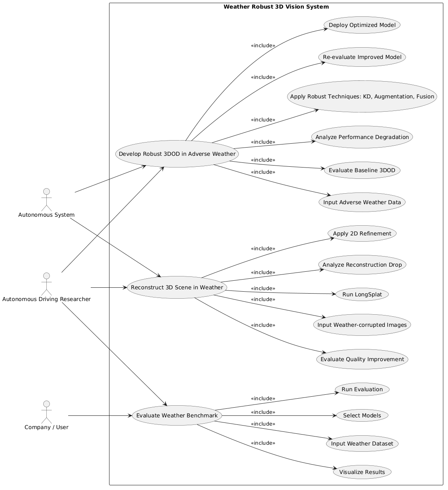

# Use Case 1 — 악천후 3DOD 통합 (논문1+2)

**이름**

- 악천후 환경에서 강건한 3D 객체 탐지 시스템 개발 및 적용

**Actor**

- 자율주행 자동차 연구자 / 자율주행 시스템

**시나리오**

1. night / rain / snow 등 악천후 데이터를 입력 및 구성
2. baseline 3DOD 모델을 실행
3. 환경별 성능 저하를 분석
4. KD, augmentation, sensor fusion 등 개선 기법 적용
5. 개선된 모델 성능 재평가
6. 최적 모델을 선택하여 시스템에 적용

**핵심 가치**

악천후 환경에서도 안정적인 객체 탐지 성능 확보 및 실제 시스템 적용 가능

---

# Use Case 2 — Weather-aware 3D Reconstruction (논문3)

**이름**

- 기상 환경에서 안정적인 3D reconstruction 시스템

**Actor**

- 연구자 / 디지털 트윈 시스템

**시나리오**

1. weather artifact가 포함된 이미지 입력
2. LongSplat 기반 3D reconstruction 수행
3. 기상 조건에 따른 성능 저하 분석
4. 2D refinement (deraining, desnowing 등) 적용
5. 개선된 입력으로 reconstruction 수행
6. 품질(PSNR, SSIM 등) 개선 여부 확인

**핵심 가치**

날씨 영향에도 안정적인 3D 장면 복원 유지

---

# Use Case 3 — 통합 Benchmark 시스템

**이름**

- Weather Robust 3D Vision Benchmark 시스템

**Actor**

- 연구자 / 기업 사용자

**시나리오**

1. 다양한 weather 데이터 입력
2. 3DOD 및 3DGS 모델 선택
3. 통합 평가 수행
4. 성능 지표(mAP, PSNR 등) 분석
5. 결과를 웹 기반으로 시각화

**핵심 가치**

다양한 기상 환경에서 모델 성능을 통합적으로 비교·분석 가능한 평가 시스템 구축

# specification

## Use Case 1

### **악천후 환경에서 강건한 3D Object Detection 시스템 개발 및 적용**

### ● Actor

- 자율주행 자동차 연구자
- 자율주행 시스템

### ● 개요

본 유즈케이스는 야간(Night), 우천(Rain), 강설(Snow) 등 다양한 기상 악조건 환경에서 3D Object Detection 모델의 성능을 분석하고, 이를 개선하여 실제 자율주행 시스템에 적용 가능한 강건한 모델을 개발하는 것을 목적으로 한다.

---

### ● 사전 조건 (Pre-condition)

- nuScenes, KITTI 등 데이터셋이 준비되어 있음
- 3DOD baseline 모델이 구축되어 있음
- 실험 환경 (GPU, 프레임워크 등)이 구성되어 있음

---

### ● 기본 흐름 (Main Flow)

1. 악천후 데이터(night, rain, snow)를 입력 및 구성한다.
2. baseline 3D Object Detection 모델을 실행한다.
3. 환경별 성능 저하를 정량적으로 분석한다.
4. Knowledge Distillation, Data Augmentation, Sensor Fusion 등의 개선 기법을 적용한다.
5. 개선된 모델의 성능을 재평가한다.
6. 최적의 모델을 선택하여 자율주행 시스템에 적용한다.

---

### ● 대안 흐름 (Alternative Flow)

- 3-1. 특정 기상 조건에서 데이터가 부족한 경우 → 데이터 증강 또는 시뮬레이션 수행
- 4-1. 단일 기법으로 성능 개선이 미흡할 경우 → 복합 기법(KD + Fusion 등) 적용

---

### ● 사후 조건 (Post-condition)

- 악천후 환경에 강건한 3DOD 모델 확보
- 실제 시스템 적용 가능한 모델 도출

---

### ● 핵심 가치

악천후 환경에서도 안정적인 객체 탐지 성능 확보

---

---

## Use Case 2

### **기상 환경에서 강건한 3D Reconstruction 시스템**

### ● Actor

- 연구자
- 디지털 트윈 시스템

---

### ● 개요

기상 노이즈가 포함된 2D 입력 환경에서 3D Reconstruction 모델의 성능 저하를 분석하고, 이를 개선하여 안정적인 3D 장면 복원을 수행한다.

---

### ● 사전 조건

- Weather artifact가 포함된 이미지 데이터 존재
- LongSplat 등 3DGS 모델 준비

---

### ● 기본 흐름

1. 기상 노이즈가 포함된 이미지를 입력한다.
2. LongSplat 기반 3D reconstruction을 수행한다.
3. 복원 성능 저하를 분석한다.
4. 2D refinement (deraining, desnowing 등)를 적용한다.
5. 개선된 입력으로 reconstruction을 수행한다.
6. PSNR, SSIM 등의 지표로 성능을 평가한다.

---

### ● 사후 조건

- 기상 환경에서도 안정적인 3D reconstruction 가능
- 품질 개선 효과 검증

---

### ● 핵심 가치

날씨 영향을 최소화한 3D 복원 유지

---

---

## Use Case 3

### **Weather Robust 3D Vision Benchmark 시스템**

### ● Actor

- 연구자
- 기업 사용자

---

### ● 개요

다양한 기상 조건에서 3DOD 및 3D Reconstruction 모델의 성능을 통합적으로 평가하고, 이를 시각화하여 비교 분석할 수 있는 Benchmark 시스템을 구축한다.

---

### ● 사전 조건

- 다양한 weather dataset 구축 완료
- 평가 지표 정의 완료

---

### ● 기본 흐름

1. 다양한 기상 조건의 데이터를 입력한다.
2. 평가할 모델을 선택한다.
3. 자동 평가를 수행한다.
4. 성능 결과를 정량적으로 분석한다.
5. 결과를 웹 기반으로 시각화한다.

---

### ● 사후 조건

- 통합 Benchmark 시스템 구축
- 모델 간 비교 가능한 평가 결과 확보

---

### ● 핵심 가치

프로젝트 전체 결과를 통합하는 평가 플랫폼
